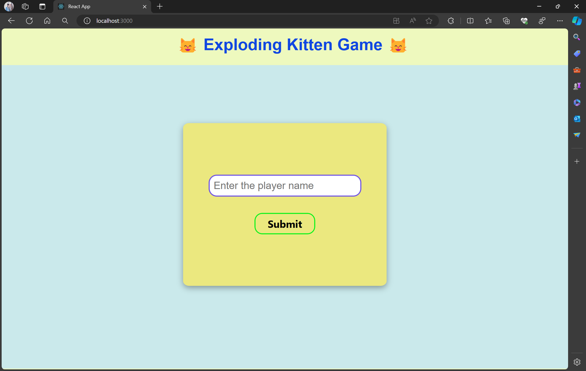
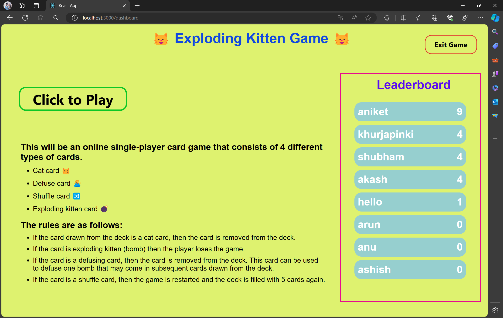
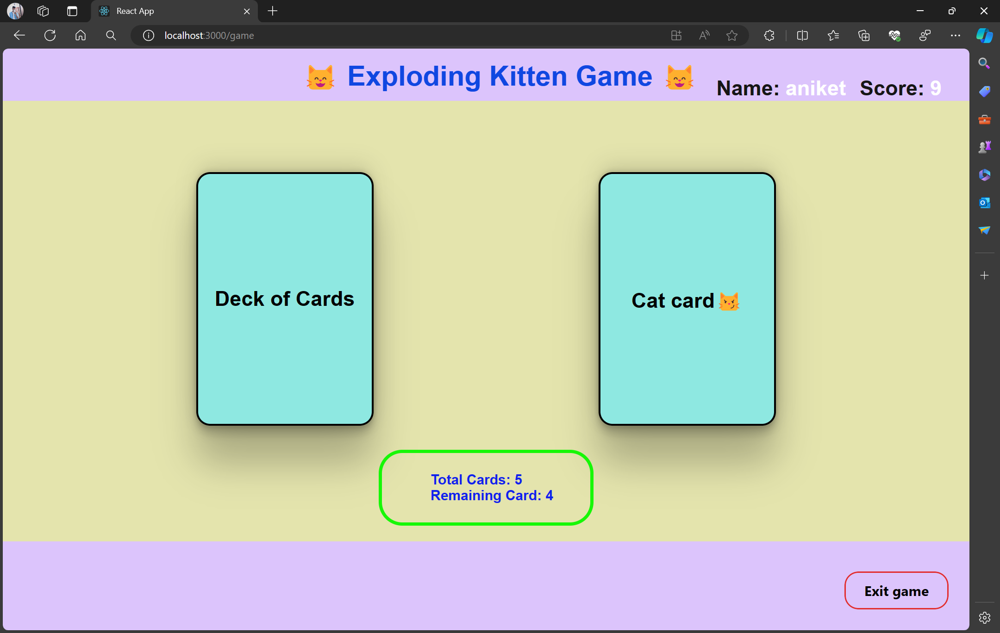

<h1>😸 Exploding Kitten</h1>

## Introduction

Welcome to Exploding Kitten, a thrilling web-based single-player card game where you embark on an adventure with four types of cards! Your objective is to draw cards strategically, avoiding the dreaded exploding kittens while navigating through various challenges.

## Game Overview
In this game, you'll encounter four types of cards:

Cat card 😼: Harmless and cute! Simply remove it from the deck.
Defuse card 🙅‍♂️: Essential for survival! Use it to defuse exploding kittens.
Shuffle card 🔀: Shake things up! Restart the game and shuffle the deck.
Exploding kitten card 💣: Danger! If drawn, you lose the game.
The game starts with a deck of 5 cards randomly ordered. Click on the deck to reveal cards one by one. Your goal is to draw all 5 cards without encountering an exploding kitten.

## Rules
Draw a card by clicking on the deck.
If you draw a cat card, it's removed from the deck.
If you draw an exploding kitten, you lose the game.
Defuse cards can save you from exploding kittens.
Shuffle cards restart the game with a new deck.
Features
User Authentication: Create a username to enter the game.
Leaderboard: Keep track of the number of games won by each player. Each win earns one point.

## Technologies Used
## Frontend: React.js
## Backend: Node.js with Express
## Database: SQLite

## Assumptions ##
The game is designed for single-player mode only.
Users have a simple authentication process requiring only a username.##
Auto-save functionality stores game state in the backend database.

## For Running code locally follow given commands

<h3>For backend server:<h3>
cd backend 
npm i 
npm start 

  
<h3>For frontend server:<h3>
cd Frontend 
npm i 
npm start 

# Project screenshots

